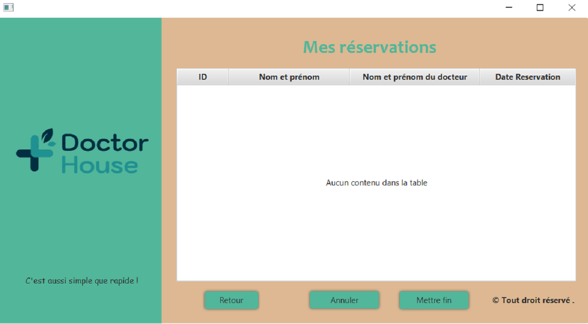

# DoctorHouse2

Projet DOCTORHOUSE

Réalisé par Nedloussi Mohammed Amine , Omar Haboub , Omar Mezzour /CYBERSECURITY.

Les interfaces :

# Interface Login:
 
# Interface Register
 
# Interface Accueil
 
# Interface Medecins
 
# Interface Reservations
 
# Interface Confidentalité
 
# Interface Conditions Générales
 
# Interface FAQ
 

Pour ce projet , il est réalisé avec JAVAFX avec le modèle MVC ( MODEL,VIEW,CONTROLLER )
Il existe 8 différents interfaces comme mentionnée ci-dessus , nous avons utilisons ECLIPSE avec JDK 19 et MYSQL.

## Le code :
## src/application/Database
public static Connection connection = null;
			static {
}
Ce code établit une connexion à une base de données MySQL nommée "doctorhouse". Les paramètres de connexion de la base de données, tels que l'URL, le nom d'utilisateur et le mot de passe, sont définis dans le bloc statique. Il utilise l'API JDBC et le pilote MySQL Connector/J pour établir une connexion à la base de données. Si la connexion est établie avec succès, il affiche "After connexion". S'il y a une erreur, il affichera la trace de pile d'erreur et la cause de l'erreur.

## src/application/Main
Ce code représente la classe principale de l'application qui hérite de la classe "Application" de JavaFX. La méthode "start" charge un fichier FXML nommé "Login.fxml" pour créer la scène de l'interface utilisateur. La scène est ensuite ajoutée à la scène principale et affichée. La méthode "main" lance l'application en appelant la méthode "launch".
src/application/Application.css
Ce code inplémente tout simplement le style CSS des différentes alertes en cas de problèmes.

## src/controllers/accueilcontroll.java
Dans notre page d'accueil , il ya une redirection vers 5 différentes interfaces avec le même code 
void redirec_conditiongenerales(ActionEvent e) throws IOException {
    	FXMLLoader loader = new FXMLLoader(getClass().getResource("/interfaces/ConditionsGenerales.fxml"));
        Stage stage=(Stage)((Node)e.getSource()).getScene().getWindow();
        stage.setScene(new Scene(loader.load()));
    	stage.show();
Exemple avec la redirection vers conditions générales

## src/controllers/conditionsgeneralescontroll.java
## src/controllers/Faq.java
## src/controllers/Confidentalite.java

Pour les 3 pages il ya seulement du texte écrit sous SceneBuilder ainsi qu'un bouton qui redirège vers l'interface Accueil
src/controllers/Login.java
void login(ActionEvent e) throws IOException, SQLException { }

Pour l'action login lorsqu'on clique sur le bouton se connecter ce code gère le processus de connexion pour un utilisateur. La méthode vérifie d'abord si le nom d'utilisateur entré existe dans la base de données en appelant la méthode "getPatient". Si le nom d'utilisateur n'existe pas, une boîte de dialogue d'erreur est affichée pour indiquer à l'utilisateur que le nom d'utilisateur est incorrect. Si le nom d'utilisateur existe, le mot de passe est vérifié en comparant le mot de passe entré à celui stocké dans la base de données. Si le mot de passe est correct, la scène de l'interface utilisateur est modifiée pour f "Accueil". Si le mot de passe est incorrect, une boîte de dialogue d'erreur est affichée pour indiquer à l'utilisateur que le mot de passe est incorrect.
void register(ActionEvent e) throws IOException {
}

Pour l'action register elle redirège tout simplement le patient pour s'inscrire .

## src/controllers/medecinscontroll.java

 void commander(ActionEvent event) throws SQLException, IOException { }

Pour l'action commander Ce code permet à un patient de commander un rendez-vous avec un médecin. Lorsque l'utilisateur clique sur le bouton "commander", la fonction vérifie si le médecin sélectionné est disponible. Si oui, la disponibilité du médecin est mise à jour pour indiquer qu'il est maintenant occupé et une réservation est créée pour l'utilisateur en utilisant les identifiants de l'utilisateur et du médecin. Enfin, l'interface est mise à jour pour afficher les réservations. Si le médecin n'est pas disponible, une erreur est affichée indiquant que l'utilisateur doit choisir un autre médecin ou attendre.

 public void initialize(URL url, ResourceBundle rb) { }

Pour l'action Ce code initialise une méthode appelée initialize qui s'exécute automatiquement à l'ouverture d'une interface JavaFX. Cette méthode prend en entrée deux paramètres : URL url et ResourceBundle rb.
Dans cette méthode, des colonnes de la table de vue (tbview) sont associées à des propriétés de la classe Doctor en utilisant setCellValueFactory.
La première colonne (id) est associée à la propriété id de la classe Doctor, la seconde colonne (name) à la propriété username, la troisième colonne (speciality) à la propriété speciality et la dernière colonne (disponibility) à la propriété Disponibilite.
Ensuite, la méthode ajoute toutes les données du médecin à la table de vue en utilisant tbview.getItems().setAll(doc.getDataDoctor());
Enfin, un message est affiché pour tester si la disponibilité des médecins a bien été enregistrée.

*void back(ActionEvent e) throws IOException { }

Pour les 3 pages il ya seulement du texte écrit sous SceneBuilder ainsi qu'un bouton qui redirège vers l'interface Accueil

public void Inscriptionn(ActionEvent event) throws SQLException, IOException { }

Ce code représente une fonction d'inscription pour un patient dans une application JavaFX utilisant le framework FXML. La fonction est déclenchée par un événement de clic sur un bouton d'inscription.
La fonction vérifie d'abord si tous les champs du formulaire (nom, nom d'utilisateur, mot de passe et adresse e-mail) sont remplis. Si ce n'est pas le cas, une boîte de dialogue d'erreur s'affiche avec un message d'erreur indiquant que les champs manquants doivent être remplis.
Sinon, la fonction vérifie si le nom d'utilisateur choisi existe déjà dans la base de données. Si c'est le cas, une boîte de dialogue d'erreur s'affiche avec un message indiquant que le nom d'utilisateur doit être unique et demandant à l'utilisateur de choisir un autre nom d'utilisateur.
Si tout est valide, la fonction crée un nouveau patient en utilisant les informations entrées dans les champs du formulaire et appelle une fonction pour ajouter le patient à la base de données. Enfin, la scène actuelle est remplacée par la page d'accueil.
public void cb(ActionEvent event) throws IOException { }

Ce code permet la redirection vers la page de LOGIN .

## src/controllers/reservationscontroll.java
void annuler_reservation(ActionEvent event) throws SQLException { }

Ce code représente une fonction en Java qui annule une réservation. La fonction prend un événement "ActionEvent" en entrée et peut lever une exception "SQLException".
La réservation sélectionnée est récupérée à partir de la table de visualisation (tbview).
Une instance de la classe "DoctorDatabase" est créée et utilisée pour récupérer un objet "Doctor" à partir du nom du médecin associé à la réservation sélectionnée.
La disponibilité du médecin est mise à jour en la définissant sur "true".
La méthode "isDispo" de la classe "DoctorDatabase" est appelée pour mettre à jour la disponibilité du médecin dans la base de données.
La méthode "deleteReservation" de la classe "ReservationData" est appelée pour supprimer la réservation sélectionnée de la base de données.
La table de visualisation (tbview) est mise à jour en affichant toutes les réservations à partir de "medecinscontroll.getReservationData().getAllReservations()".

void mettre_fin(ActionEvent event) throws SQLException { }
Cette fonction "mettre_fin" gère l'annulation d'une réservation sélectionnée dans un tableau "tbview". Elle obtient d'abord la réservation sélectionnée et le modèle de médecin associé à partir de la base de données des réservations. Ensuite, la disponibilité du médecin est définie sur "vrai" et mise à jour dans la base de données. Enfin, la réservation sélectionnée est supprimée de la base de données et le tableau "tbview" est mis à jour avec les réservations restantes
void back(ActionEvent e) throws IOException { }
Retour vers L'acceuil
public void initialize(URL arg0, ResourceBundle arg1) { }
Ce code initialise une vue pour afficher les données de réservation dans une table (tbview). Les colonnes de la table, date, nom de médecin, nom de patient et id, sont définies pour afficher les valeurs associées à chaque réservation à partir de la propriété de l'objet de réservation. Ensuite, la fonction obtient une liste de toutes les réservations à partir de la classe de contrôle "medecinscontroll" et met à jour la table (tbview) en conséquence. En cas d'erreur de connexion à la base de données, une exception est générée et les détails de l'erreur sont imprimés.

## src/database/DoctorDatabase
public void isDispo(Doctor doctor) throws SQLException { }

public ObservableList<Doctor> getDataDoctor() { }

Ce code est une méthode qui obtient une liste de tous les modèles de médecins stockés dans une base de données. Il définit d'abord une liste observable "Doctors" pour stocker les modèles de médecins. Ensuite, il utilise une connexion à la base de données (conn) pour exécuter une requête SQL qui sélectionne toutes les entrées de la table "doctor". Pour chaque entrée, un nouvel objet de modèle de médecin est créé avec les données récupérées à partir de la base de données (ID, nom d'utilisateur, spécialité, disponibilité) et ajouté à la liste observable "Doctors". Enfin, la méthode renvoie la liste "Doctors" qui contient les modèles de médecins.
public  Doctor getDoctor(int id) throws SQLException { }

Ce code permet de récupérer les informations d'un médecin à partir d'une base de données en utilisant un ID donné et renvoie un objet Doctor.
Une requête est créée pour sélectionner toutes les colonnes de la table "médecin" où l'ID est égal à l'argument fourni.
L'objet PreparedStatement est créé à partir de la requête et l'ID fourni est défini comme premier paramètre.
La requête est exécutée et le résultat est stocké dans un objet ResultSet.
Le ResultSet est parcouru pour peupler les champs d'un objet Doctor (dr).
La variable booléenne "isnotnull" est définie sur true si le ResultSet n'est pas vide.
Si "isnotnull" est true, l'objet Doctor peuplé est renvoyé, sinon, null est renvoyé.
## src/database/PatientDatabase

public Patient getPatient(String username) throws SQLException  { }

Ce code en Java définit une méthode appelée "getPatient" qui permet de récupérer les informations d'un patient dans une base de données en utilisant un nom d'utilisateur donné en entrée.
La méthode lance une exception "SQLException" en cas d'erreur avec la base de données.
La méthode crée une requête SQL pour sélectionner les informations d'un patient en utilisant l'objet "PreparedStatement". La requête définit un paramètre pour le nom d'utilisateur du patient (récupéré en entrée).
Lorsque la requête est exécutée avec "executeQuery", les informations du patient sont retournées dans un objet "ResultSet".
Le code itère sur les résultats du "ResultSet" pour trouver les informations du patient associé au nom d'utilisateur donné. Si les informations sont trouvées, elles sont mises à jour dans un nouvel objet "Patient" créé pour stocker les informations.

Enfin, le code retourne l'objet "Patient" rempli si les informations ont été trouvées, sinon retourne "null".

public void addPatient(Patient patient) throws SQLException { }
Ce code en Java définit une méthode appelée "addPatient" qui permet d'ajouter un nouveau patient dans une base de données.
La méthode lance une exception "SQLException" en cas d'erreur avec la base de données.
La méthode crée une requête SQL pour insérer un nouveau patient dans la table "patient" en utilisant l'objet "PreparedStatement". La requête définit les valeurs à insérer pour le nom, le nom d'utilisateur, le mot de passe et l'adresse e-mail du patient.
Lorsque la requête est exécutée avec "executeUpdate", les informations du patient sont ajoutées à la table "patient".
Enfin, le code affiche un message de confirmation "Patient ajouté".

## src/database/ReservationData

public void  deleteReservation(Reservation reservation) throws SQLException { }

Ce code en Java définit une méthode appelée "deleteReservation" qui permet de supprimer une réservation d'un patient dans une base de données.
La méthode lance une exception "SQLException" en cas d'erreur avec la base de données.
Tout d'abord, la méthode appelle la méthode "getAllReservations" pour récupérer la liste de toutes les réservations existantes.
Ensuite, la méthode crée une requête SQL pour supprimer la réservation spécifiée en utilisant l'objet "PreparedStatement". La requête définit le ID de la réservation à supprimer.
Lorsque la requête est exécutée avec "executeUpdate", la réservation est supprimée de la table "reservation".
Enfin, le code effectue une boucle à travers la liste de toutes les réservations pour trouver la réservation correspondant au ID spécifié et la supprime de la liste "reservations".

public ObservableList<Reservation> getAllReservations() throws SQLException {

Ce code est une méthode qui récupère toutes les réservations associées à un patient en utilisant une base de données SQL.
La première étape consiste à récupérer l'ID du patient en utilisant l'objet logincontrol.
La requête SQL "select * from reservation where Patient_idPatient = ?" est préparée pour sélectionner toutes les réservations associées à l'ID du patient.
L'ID du patient est alors défini pour la requête préparée en utilisant la méthode setInt.
La requête est exécutée et le résultat est stocké dans un objet ResultSet.
Ensuite, une liste observable de réservations est créée en utilisant FXCollections.observableArrayList.
Pour chaque enregistrement dans le ResultSet, un objet Reservation est créé et les détails de la réservation sont récupérés à partir du ResultSet.
Les objets Reservation sont ajoutés à la liste observable de réservations.
Finalement, la liste observable de réservations est renvoyée.
## src/models/Patient
Attributs
Setters and getters
Contructors

## src/models/Doctor
Attributs
Setters and getters
Contructors
## src/models/Reservation

Attributs
Setters and getters
Contructors
